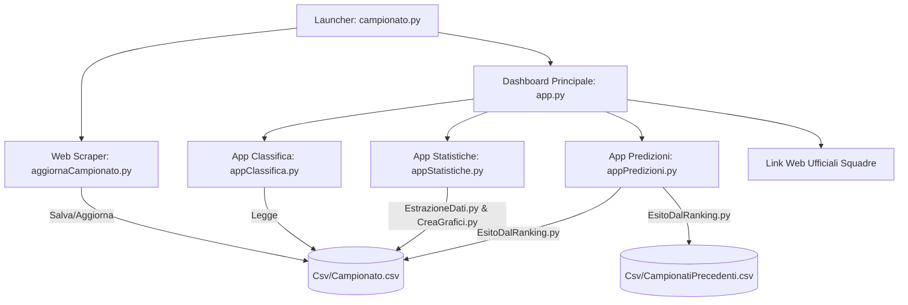

# ⚽ Documentazione Completa del Progetto: Campionato di Calcio

Questa documentazione descrive in dettaglio **che cosa fa** l'applicazione, la sua **architettura**, i **moduli** che la compongono e **come** elabora i dati, calcola le statistiche e genera le predizioni avanzate per le partite di Serie A.

---

## 📌 Indice dei Contenuti

1. [Panoramica Generale (Che cosa fa)](#-1-panoramica-generale-che-cosa-fa)
2. [Architettura del Sistema](#-2-architettura-del-sistema)
3. [I Moduli del Programma (Come lo fa)](#-3-i-moduli-del-programma-come-lo-fa)
   - [3.1. Avvio e Dashboard Principale (`campionato.py`, `app.py`)](#31-avvio-e-dashboard-principale-campionatopy-apppy)
   - [3.2. Web Scraping & Aggiornamento Risultati (`aggiornaCampionato.py`)](#32-web-scraping--aggiornamento-risultati-aggiornacampionatopy)
   - [3.3. Estrazione Dati e Metadati (`EstrazioneDati.py`, `TrasformaFileCsv.py`, `VisualizzaMetadati.py`)](#33-estrazione-dati-e-metadati-estrazionedatipy-trasformafilecsvpy-visualizzametadatipy)
   - [3.4. Gestione e Visualizzazione della Classifica (`appClassifica.py`)](#34-gestione-e-visualizzazione-della-classifica-appclassificapy)
   - [3.5. Statistiche & Grafici Dinamici (`appStatistiche.py`, `CreaGrafici.py`)](#35-statistiche--grafici-dinamici-appstatistichepy-creagraficipy)
   - [3.6. Motore di Predizione e Consulenza Scommesse (`appPredizioni.py`, `EsitoDalRanking.py`)](#36-motore-di-predizione-e-consulenza-scommesse-apppredizionipy-esitodalrankingpy)
4. [L'Algoritmo di Predizione nel Dettaglio](#-4-lalgoritmo-di-predizione-nel-dettaglio)
5. [Struttura Dati e File del Progetto](#-5-struttura-dati-e-file-del-progetto)
6. [Tecnologie e Librerie Utilizzate](#-6-tecnologie-e-librerie-utilizzate)
7. [Istruzioni per l'Avvio](#-7-istruzioni-per-lavvio)

---

## 🌟 1. Panoramica Generale (Che cosa fa)

Il programma è una **suite software desktop professionale** progettata per il monitoraggio, l'analisi statistica e la predizione dei risultati del campionato di calcio italiano di **Serie A**.

Le sue funzioni chiave includono:
* **Scraping e sincronizzazione automatica dei risultati**: scarica in tempo reale risultati, calendari e date delle partite dalla piattaforma sportiva *SoccerStats*, preservando uno storico sicuro con copie di backup.
* **Dashboard interattiva e portale squadre**: accesso rapido ai siti ufficiali delle 20 squadre di Serie A e launcher delle singole sotto-applicazioni.
* **Classifica intelligente**: visualizzazione tabellare con calcolo dinamico di punti, gol fatti, gol subiti, differenza reti e colorazione automatica per qualificazione UEFA (Champions, Europa, Conference League) e zone salvezza/retrocessione/spareggio.
* **Analisi statistica e comparativa**: confronto testa a testa tra squadra di casa e squadra in trasferta con generazione in tempo reale di grafici a barre (esiti, gol fatti/subiti) e grafici di trend cronologico.
* **Modello matematico di predizione avanzata e AI Betting Advice**: stima della forza delle squadre (combinando dati correnti e campionati storici), calcolo della forma recente nelle ultime 5 partite, probabilità esiti (1, X, 2), probabilità Over/Under (1.5 e 2.5), analisi degli scontri diretti e raccomandazioni di scommessa con livello di rischio e motivazione tecnica analitica.

---

## 🏛️ 2. Architettura del Sistema

L'applicazione segue un'architettura modulare a livelli:



---

## 🧩 3. I Moduli del Programma (Come lo fa)

### 3.1. Avvio e Dashboard Principale (`campionato.py`, `app.py`)
* **`campionato.py`**: È l'entry point universale. Rileva se il programma viene eseguito come script Python standard o come eseguibile compilato (`.exe` via PyInstaller). Lancia in sequenza l'aggiornamento automatico e la finestra principale.
* **`app.py` (`MainWindow`)**:
  * Inizializza l'interfaccia Qt (`UI/Window.py`) e adatta lo stile grafico dark/moderno.
  * Carica i loghi e i collegamenti URL delle 20 squadre da `Csv/UrlSquadre.csv`. Cliccando su ogni squadra, apre il browser predefinito sul sito ufficiale del club.
  * Gestisce i processi figli delle sotto-applicazioni (`AppClassifica`, `AppStatistiche`, `RunPredizioni`) assicurando che alla chiusura della finestra principale tutti i processi e le risorse vengano terminati e deallocati correttamente.
  * Integra `CheckFile.checkFilesExistence()` per verificare la presenza dei file indispensabili all'avvio.

---

### 3.2. Rollover Stagionale e Web Scraping (`GestoreStagione.py`, `aggiornaCampionato.py`)
* **Modulo `GestoreStagione.py` (Rollover Annuale Automatico)**:
  * **Archiviazione Storico**: Trasforma automaticamente le partite della stagione conclusa (es. `2025/26`) nel formato archivio e le accoda a `Csv/CampionatiPrecedenti.csv` prevenendo duplicazioni.
  * **Rilevamento Nuove 20 Squadre**: Rileva le squadre partecipanti alla nuova stagione (inclusi club neo-promossi), normalizza i nomi e aggiorna `Csv/UrlSquadre.csv`.
  * **Download Automatico Scudetti**: Verifica la presenza di ciascuno stemma in `Immagini/Scudetti/{Squadra}.png` e scarica in tempo reale il file PNG trasparente ad alta risoluzione da Wikipedia qualora manchi.
  * **Mappatura Siti Ufficiali**: Associa dinamicamente a ciascuna squadra il proprio sito web ufficiale.
* **Modulo `aggiornaCampionato.py` (Scraping e Sincronizzazione)**:
  * Esegue richieste HTTP robuste tramite `curl_cffi` (con impersonificazione browser per superare le protezioni anti-bot Cloudflare) verso *SoccerStats* (`https://www.soccerstats.com/results.asp?league=italy&pmtype=round{N}`).
  * Estrae e valida in tempo reale i risultati delle giornate giocate.
  * Salva le partite della stagione corrente in `Csv/Campionato.csv`.
  * Ricalcola istantaneamente e salva la classifica aggiornata in `Csv/Classifica.csv`.


---

### 3.3. Estrazione Dati e Metadati (`EstrazioneDati.py`, `TrasformaFileCsv.py`, `VisualizzaMetadati.py`)
* **`EstrazioneDati.py`**:
  * **Classe `EstrazioneDati`**: Fornisce metodi per estrarre vittorie, pareggi, sconfitte, gol fatti, gol subiti, serie cronologica degli esiti, punti, differenza reti e ranking, con supporto ai filtri:
    * `'generali'`: totale campionato
    * `'casa'`: solo partite giocate nello stadio di casa
    * `'trasferta'`: solo partite giocate fuori casa
  * **Classe `MetaDatiDf`**: Genera un report dettagliato sulla qualità dei dati (dimensioni, valori nulli, tipi di dato, statistiche descrittive come media, mediana, quartili e deviazione standard) esportandolo in CSV (`Campionato_metadati.csv`) e JSON (`Campionato_metadati.json`).
  * **Classe `UltimiCinquePartite`**: Estrae le ultime 5 partite giocate da una determinata squadra.
* **`TrasformaFileCsv.py`**: Dizionari di traduzione per convertire intestazioni in inglese, mesi (`'Jan'` $\rightarrow$ `'Gen'`) e giorni della settimana (`'Sa'` $\rightarrow$ `'Sab'`).
* **`VisualizzaMetadati.py`**: Interfaccia grafica dedicata con `QScrollArea` e `QTableWidget` per consultare visivamente la struttura e la qualità dei dataset.

---

### 3.4. Gestione e Visualizzazione della Classifica (`appClassifica.py`)
* **Calcolo della Classifica**:
  * Scansiona tutte le partite giocate in `Csv/Campionato.csv`.
  * Assegna 3 punti per vittoria, 1 per pareggio, 0 per sconfitta.
  * Calcola Partite Giocate (PG), Vittorie (V), Pareggi (P), Sconfitte (S), Gol Fatti (GF), Gol Subiti (GS) e Differenza Reti (DR).
  * Ordina secondo i criteri ufficiali: Punti descrescenti $\rightarrow$ Differenza Reti descrescente $\rightarrow$ Gol Fatti decrescenti.
* **Visualizzazione con `MyTableModel` (QAbstractTableModel)**:
  * Evidenziazione cromatica delle righe:
    * 🟦 **Blu**: Prime 4 posizioni $\rightarrow$ UEFA Champions League
    * 🟨 **Giallo**: 5ª posizione $\rightarrow$ UEFA Europa League
    * 🟩 **Verde**: 6ª e 7ª posizione $\rightarrow$ UEFA Conference League
    * 🟥 **Rosso**: Ultime 3 posizioni (18°, 19°, 20°) $\rightarrow$ Retrocessione diretta
    * 🟧 **Arancione**: 17ª e 18ª posizione in caso di arrivo a pari punti $\rightarrow$ Spareggio Salvezza
* **Integrazione Sky Sport**:
  * Barra laterale con pulsanti interattivi per accedere a: Classifica live, Calendario/Risultati, Ultime Notizie, Probabili Formazioni, Classifica Marcatori, Programma TV e Highlights.

---

### 3.5. Statistiche & Grafici Dinamici (`appStatistiche.py`, `CreaGrafici.py`)
* **Interfaccia Utente (`AppStatistiche`)**:
  * Due menu a tendina (`QComboBox`) per selezionare la Squadra di Casa e la Squadra in Trasferta.
  * Visualizzazione affiancata con due pannelli indipendenti a scorrimento verticale (`QScrollArea`).
  * Mostra statistiche testuali su tre riquadri per squadra: Generali, In Casa e In Trasferta.
* **Generazione Grafici (`CreaGrafici.py`)**:
  * Utilizza **Matplotlib** con backend non-bloccante:
    1. **Grafico Esiti** (`crea_graficoStatistiche`): Barre colorate per Vittorie (verde), Pareggi (giallo), Sconfitte (rosso).
    2. **Grafico Gol** (`crea_goalsFattiSubiti`): Barre a confronto tra Gol Fatti (verde) e Gol Subiti (rosso).
    3. **Grafico Trend** (`Crea_graficoTrend`): Linea temporale con area ombreggiata che traccia l'andamento cumulativo dei risultati (vittoria $+1$, pareggio $0$, sconfitta $-1$) nel corso delle giornate.
  * I grafici generati vengono salvati come immagini `.png` in `Immagini/Grafici/` e renderizzati istantaneamente nei rispettivi widget `QLabel` di PyQt5 tramite `QPixmap`.

---

### 3.6. Motore di Predizione e Consulenza Scommesse (`appPredizioni.py`, `EsitoDalRanking.py`)
È il modulo più avanzato del progetto: implementa un sistema esperto di analisi predittiva.

* **Funzionalità dell'interfaccia (`RunPredizioni`)**:
  * Selezione delle due squadre e caricamento dinamico degli stemmi ufficiali (`Immagini/Scudetti/{Squadra}.png`).
  * Barra di avanzamento (`ProgressBar`) durante l'elaborazione dei calcoli.
  * Pannelli dedicati per:
    * **Predizione Gol ed Esito**: gol stimati per squadra, esito base (1, X, 2), Doppia Chance consigliata.
    * **Probabilità Percentuali**: % Vittoria Casa, % Pareggio, % Vittoria Trasferta.
    * **Quote Over/Under**: stime probabilistiche su Under/Over 1.5 e Under/Over 2.5.
    * **Forma Recente**: punteggio medio su scala da 0.0 a 3.0 punti/partita nelle ultime 5 sfide.
    * **Ranking Comparativo**: posizionamento a confronto su Campionato Attuale, Ultime 5 Partite e Campionati Precedenti (Generale, In Casa, In Trasferta).
    * **Scontri Diretti Storici**: bilancio vittorie/pareggi e dettaglio delle ultime partite giocate tra i due club.
    * **Analisi AI e Consigli Scommesse**:
      * Scommessa Consigliata principale (con % di successo).
      * Livello di rischio calcolato (🟢 Basso, 🟡 Medio, 🔴 Alto).
      * Motivazione tecnica completa.
      * Combo suggerita (es. `1 + Under 2.5`).
      * Commento contestuale finale con livello di confidenza (Alta, Media, Bassa).
    * **Grafico Comparativo Integrato** (`confronto_squadre.png`): visualizza a barre tutte le metriche normalizzate (Forza, Gol Fatti, Gol Subiti, V, P, S, Forma, Ranking).

---

## 📐 4. L'Algoritmo di Predizione nel Dettaglio

Il modello matematico implementato in `EsitoDalRanking.py` opera secondo i seguenti passaggi analitici:

### 1. Calcolo dell'Indice di Forza ($F$)
Per ogni squadra viene calcolato un indice di forza ponderato basato sulla prestazione complessiva:
$$F = \alpha \cdot GF - \beta \cdot GS + \gamma \cdot V + \delta \cdot X - \varepsilon \cdot S$$

*Con pesi impostati a:* $\alpha=1.0$, $\beta=0.8$, $\gamma=3.0$, $\delta=1.0$, $\varepsilon=2.0$.

### 2. Integrazione Ponderata con lo Storico
Se sono disponibili i dati dei campionati storici precedenti, l'indice di forza combinato ($F_{comb}$) è:
$$F_{comb} = \omega_{att} \cdot F_{attuale} + (1 - \omega_{att}) \cdot F_{storico}$$
*(Dove $\omega_{att} = 0.6 \div 0.7$ è il peso attribuito alla stagione attuale).*

### 3. Calcolo dell'Indice di Forma Recente ($\Phi$)
Calcolato sulle ultime 5 partite disputate (3 punti per vittoria, 1 per pareggio, 0 per sconfitta):
$$\Phi = \frac{\sum_{i=1}^{k} \text{Punti}_i}{k} \quad (k \le 5, \quad \Phi \in [0.0, 3.0])$$

### 4. Calcolo delle Probabilità di Esito ($P_1, P_X, P_2$)
Viene calcolato il differenziale totale tra squadra di casa e trasferta considerando sia la forza che la forma, con l'aggiunta del fattore campo (vantaggio casalingo base di $0.45$ vs $0.35$):
$$\Delta_{\text{tot}} = (F_{\text{casa}} - F_{\text{trasf}}) + 10 \cdot (\Phi_{\text{casa}} - \Phi_{\text{trasf}})$$

$$P_1 = \text{clip}\left(0.45 + \frac{\Delta_{\text{tot}}}{200}, 0.15, 0.85\right)$$
$$P_2 = \text{clip}\left(0.35 - \frac{\Delta_{\text{tot}}}{200}, 0.15, 0.85\right)$$
$$P_X = \max(0.10, 1 - (P_1 + P_2))$$

### 5. Stima dei Gol e Quote Over/Under
I gol attesi per ciascuna squadra sono calcolati incrociando l'attacco della squadra con la difesa avversaria:
$$\text{Goal}_{\text{casa}} = \frac{1}{2} \left( \frac{GF_{\text{casa}}}{PG_{\text{casa}}} + \frac{GS_{\text{trasf}}}{PG_{\text{trasf}}} \right)$$
$$\text{Goal}_{\text{trasf}} = \frac{1}{2} \left( \frac{GF_{\text{trasf}}}{PG_{\text{trasf}}} + \frac{GS_{\text{casa}}}{PG_{\text{casa}}} \right)$$
$$\text{Goal}_{\text{totali}} = \text{Goal}_{\text{casa}} + \text{Goal}_{\text{trasf}}$$

Le probabilità Over/Under sono derivate da:
$$P(\text{Under 2.5}) = \max\left(0, 1 - \frac{\text{Goal}_{\text{totali}}}{5.0}\right), \quad P(\text{Over 2.5}) = 1 - P(\text{Under 2.5})$$
$$P(\text{Under 1.5}) = \max\left(0, 1 - \frac{\text{Goal}_{\text{totali}}}{3.5}\right), \quad P(\text{Over 1.5}) = 1 - P(\text{Under 1.5})$$

### 6. Sistema di Consulenza Scommesse Intelligente
* Se $P_1 \ge 0.65 \rightarrow$ Scommessa consigliata: **Doppia Chance 1X** (successo stimato $P_1 + P_X$).
* Se $P_2 \ge 0.65 \rightarrow$ Scommessa consigliata: **Doppia Chance X2** (successo stimato $P_2 + P_X$).
* Se $P_1 \ge 0.55 \rightarrow$ Scommessa consigliata: **Segno 1**.
* Se $P_2 \ge 0.55 \rightarrow$ Scommessa consigliata: **Segno 2**.
* Se c'è grande incertezza ma $P_X \ge 0.25 \rightarrow$ **Doppia Chance 12**.
* **Livello di Rischio**:
  * 🟢 **Basso**: Probabilità massima $\ge 70\%$ e differenza forma minima ($< 0.5$).
  * 🟡 **Medio**: Probabilità massima $\ge 60\%$ o forma sbilanciata ($> 1.0$).
  * 🔴 **Alto**: Negli altri casi o per partite con alta varianza.

---

## 📁 5. Struttura Dati e File del Progetto

```text
g:/Campionato/
│
├── campionato.py               # Launcher principale (gestione .py / .exe)
├── app.py                      # Finestra principale (Dashboard & Menu Squadre)
├── aggiornaCampionato.py       # Modulo Web Scraping da SoccerStats
├── appClassifica.py            # Modulo e GUI Classifica Serie A
├── appStatistiche.py           # Modulo e GUI Statistiche e Confronto
├── appPredizioni.py            # Modulo e GUI Predizioni Partite
├── EsitoDalRanking.py          # Motore matematico di calcolo predittivo e AI Betting
├── EstrazioneDati.py           # Layer di estrazione dati, statistiche e metadati
├── CreaGrafici.py              # Motore di rendering grafici con Matplotlib
├── TrasformaFileCsv.py         # Utility di mappatura e traduzione nomenclatura
├── VisualizzaMetadati.py       # GUI viewer dei metadati e qualità dataset
├── myPath.py                   # Gestore centralizzato dei percorsi filesystem
│
├── Csv/                        # Cartella contenente i dataset CSV
│   ├── Campionato.csv          # Dati partite e risultati stagione corrente
│   ├── Campionato_backup.csv   # Backup automatico di sicurezza
│   ├── CampionatiPrecedenti.csv# Dati partite stagioni storiche
│   ├── Classifica.csv          # Classifica elaborata
│   ├── UrlSquadre.csv          # Squadre, loghi e link siti ufficiali
│   └── Campionato_metadati.csv # Report qualità dataset in formato CSV
│
├── Excel/                      # Dataset originali Excel (.xlsm)
│   ├── Campionato.xlsm
│   └── CampionatiPrecedenti.xlsm
│
├── UI/                         # File di interfaccia utente (PyQt5 .ui e .py)
│   ├── Window.py / Window.ui
│   ├── Classifica.py / Classifica.ui
│   ├── Grafici.py / Grafici.ui
│   ├── Predizioni.py / Predizioni.ui
│   └── AggiornaCampionato_ui.py
│
├── Immagini/                   # Risorse grafiche e asset
│   ├── Scudetti/               # Stemmi in formato PNG delle squadre
│   ├── Grafici/                # Grafici statistici generati dinamicamente
│   ├── Icone/                  # Icone applicazione
│   └── Sfondo per App/         # Sfondi grafici dell'interfaccia
│
└── Json/                       # Metadati e configurazioni in formato JSON
    └── Campionato_metadati.json
```

---

## 💻 6. Tecnologie e Librerie Utilizzate

| Componente | Tecnologia | Ruolo nel Progetto |
| :--- | :--- | :--- |
| **Linguaggio** | Python 3.13 | Core logic del software |
| **Interfaccia Grafica (GUI)** | PyQt5, Qt Designer | Finestre, layout, tabelle, segnali ed eventi |
| **Elaborazione Dati** | Pandas, NumPy | Dataframe, aggregazioni, statistiche, filtraggi |
| **Web Scraping** | BeautifulSoup4, Requests | Download e parsing automatico risultati web |
| **Visualizzazione Dati** | Matplotlib | Generazione grafici a barre e trend temporali |
| **Threading** | QThread (PyQt5) | Scraping asincrono non bloccante con progress bar |
| **Build & Distribuzione** | PyInstaller | Compilazione in file `.exe` standalone per Windows |

---

## 🚀 7. Istruzioni per l'Avvio

### Esecuzione tramite Python
Per avviare l'intero flusso (aggiornamento + dashboard):
```bash
python campionato.py
```

Per avviare direttamente la dashboard principale:
```bash
python app.py
```

Per avviare direttamente i singoli moduli:
```bash
python appClassifica.py       # Apre direttamente la Classifica
python appStatistiche.py      # Apre direttamente Statistiche & Grafici
python appPredizioni.py       # Apre direttamente il modulo Predizioni
python VisualizzaMetadati.py  # Apre il visualizzatore metadati dataset
```
